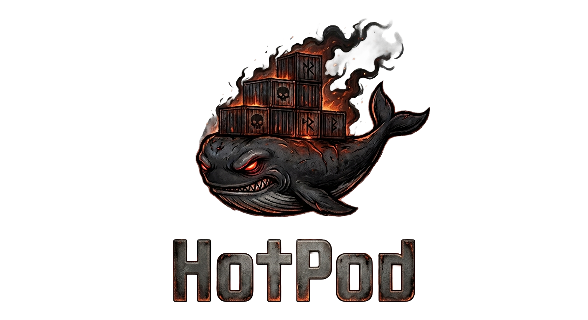
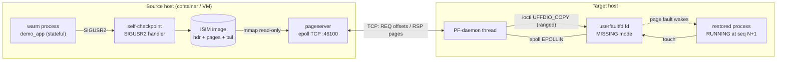

<h1 align="center">
  
</h1>

[](https://github.com/MaNiSh-9211/HotPod/actions/workflows/ci.yml)
[](https://github.com/MaNiSh-9211/HotPod/actions/workflows/criu.yml)
[](LICENSE)

**HotPod makes autoscaling instant**: a pre-warmed Linux process is
checkpointed, resumed on another host in **sub-millisecond time with 0 % of
its heap present**, and its memory streams in on demand through
`userfaultfd` while the process is already serving traffic. A 64 MB warm
instance goes from checkpoint to `RUNNING` in **0.17–0.55 ms** — versus
~2.2 s cold start and ~26 ms eager full-copy — and the restored instance
continues its own sequence counter (`seq N → N+1`) with byte-identical CRC:
it *resumed*, it did not restart.

## System architecture



Every connection above is real code: the checkpoint path lives in
[`phase3/demo_app.c`](phase3/demo_app.c), the wire in
[`phase2/common.h`](phase2/common.h) + [`phase2/pageserver.c`](phase2/pageserver.c),
and the fault path in [`phase2/restorer.c`](phase2/restorer.c) /
[`phase3/puller.h`](phase3/puller.h).

## Feature matrix

| Category | Features | Status |
|---|---|---|
| Kernel paging | `userfaultfd(MISSING)` registration, ranged `UFFDIO_COPY`, eventfd teardown | ✅ shipped |
| Wire protocol | framed META/PAGES/BYE, offset addressing, per-page status, CRC32 digest | ✅ shipped |
| Prefetch | adaptive lookahead (1→32 pages), tagged ring cache, piggyback batching | ✅ shipped |
| Hydration perf | speculative run-merging: one ranged ioctl installs waiter + successors | ✅ shipped |
| Resilience | self-healing re-request, duplicate-response tolerance, partial-write resume | ✅ shipped |
| Lifecycle | SIGUSR2 self-checkpoint → eager/lazy resume, uptime + seq continuity | ✅ shipped |
| Multi-host | two-container migration over docker bridge; orchestrator w/ gates | ✅ shipped |
| Fan-out | N replicas from one checkpoint, concurrently | ✅ shipped |
| CRIU bridge | source-built CRIU v4.1 in CI; eager dump→restore continuity proven | ✅ CI-verified |
| CRIU lazy-pages (`--lazy-pages`) | privileged-root experiment wired, diagnostics artifacted | 🔄 experimental |
| Kubernetes CRD | `HotPodSession` design sketched in roadmap | ⏳ planned |

## Key design decisions

| # | Decision | Approach | Why |
|---|---|---|---|
| 1 | Fault interception | `userfaultfd(2)` + epoll daemon, not signals/ptrace | kernel-native, no signal storms, scales to many pages (ADR-0001) |
| 2 | Addressing | region *offsets* on the wire, never virtual addresses | source/target ASLR layouts may differ post-CRIU (ADR-0002) |
| 3 | Prefetch store | FIFO ring of tagged slots, **full-scan** tag lookup | lookup must never miss an already-fetched page (deadlock class, ADR-0003) |
| 4 | Installation | speculative run-merging: ranged `UFFDIO_COPY` covers waiter + fetched successors | ~31 pages per syscall measured; hydration 107→439 MB/s (ADR-0004) |
| 5 | Lost-prefetch recovery | idempotent re-request when fault finds neither ring nor in-flight state | evictions must not deadlock (ADR-0005) |
| 6 | Teardown | eventfd poked before `pthread_join`; fds closed only after join | close-under-reader races caused EBADF (ADR-0006) |
| 7 | Language | C11 + raw syscalls for cores; orchestrators in bash/PowerShell | zero-GC, exact struct/ioctl layout for kernel contracts (ADR-0007) |
| 8 | Capture format | self-describing ISIM image `[hdr][pages][tail{seq,uptime}]` | portable lifecycle today; CRIU parser ready beside it (ADR-0008) |
| 9 | Dev workflow | everything tested from Windows via privileged Docker Desktop containers | userfaultfd is Linux-only; dev box is Windows (ADR-0009) |

Full rationale: [docs/decisions/](docs/decisions/).

## Quick start

Windows (primary):

```powershell
git clone https://github.com/MaNiSh-9211/HotPod.git
cd HotPod
powershell -ExecutionPolicy Bypass -File hotpod.ps1 all     # phases 1-4, green
```

Linux / macOS-style shell:

```bash
docker compose up --build -d && docker compose logs -f target   # multi-host demo
# or natively (Linux ≥ 5.11): make -C phase2 && make -C phase2 demo
```

## Ports & endpoints

| Port | Component | Defined in |
|---|---|---|
| 46100 | pageserver default (phase2/multihost/compose) | `IS_DEFAULT_PORT`, common.h |
| 46200 | phase3 orchestrator runs | phase3/hotpod.sh `PORT` |
| 46250 | fan-out spike | phase3/fanout.sh `PORT` |
| 46333 | CI lazy-pages page-server | .github/workflows/criu.yml |

Container name `hotpod-src`, network `hotpod-net` (see
[docker-compose.yml](docker-compose.yml)).

## Documentation

| Doc | Contents |
|---|---|
| [docs/ARCHITECTURE.md](docs/ARCHITECTURE.md) | module-level graph, degradation matrix, perf budget |
| [docs/REQUEST_LIFECYCLE.md](docs/REQUEST_LIFECYCLE.md) | one page-fault, traced end-to-end with measured costs |
| [docs/DIAGRAMS.md](docs/DIAGRAMS.md) | visual reference: defense-in-depth, pipelines, state machines |
| [docs/AOT_COMPARISON.md](docs/AOT_COMPARISON.md) | vs GraalVM/Quarkus ahead-of-time compilation |
| [docs/decisions/](docs/decisions/) | architecture decision records |
| [DOCKER.md](DOCKER.md) | every build/run/log command, both shells |
| [CHANGELOG.md](CHANGELOG.md) | reverse-chronological, ADR-referenced |

## License

MIT — see [LICENSE](LICENSE).
