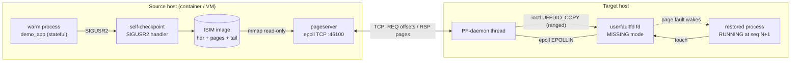

<h1 align="center">
  
</h1>

[](https://github.com/MaNiSh-9211/HotPod/actions/workflows/ci.yml)
[](https://github.com/MaNiSh-9211/HotPod/actions/workflows/criu.yml)
[](LICENSE)

**HotPod makes autoscaling instant**: a pre-warmed Linux process is
checkpointed, resumed on another host in **sub-millisecond time with 0 % of
its heap present**, and its memory streams in on demand through
`userfaultfd` while the process is already serving traffic. A 32 MB warm
instance goes from checkpoint to `RUNNING` in **~0.6 ms** — versus
~0.7 s of genuine cold-start work and ~8 ms eager full-copy — and the
restored instance continues its own sequence counter (`seq N → N+1`) with
byte-identical CRC: it *resumed*, it did not restart.

## Why it matters — real numbers, no simulation

Cold start below does **genuine work**: loads and CRC-verifies a 256 MB
dataset before serving (the "load models / build indexes" tax every real
service pays). Nothing is slept away.

| Mode (32 MB heap + real 256 MB data-load+verify) | Activation | vs cold |
|---|---|---|
| Cold start (genuine work: 256 MB load + CRC verify) | 655–710 ms | baseline |
| Eager resume | 8.1 ms | ~85× |
| Lazy resume (HotPod) | **0.580 ms** | **~1,130×** |

Reproduce: `powershell -File hotpod.ps1 p3` (battery) — every run prints
`RESULT` lines and matching CRC digests on both sides.

## How it works — from the problem to the mechanism

### The problem

In Kubernetes/serverless environments, when traffic spikes, the autoscaler
adds replicas. But a new replica is a **newborn process** — it must rebuild
its entire world from zero: load datasets, rebuild caches, warm connection
pools, JIT-compile hot code. For a JVM service that's **5–40 seconds** of
dead time per pod, during exactly the moment you're having a traffic
emergency. *The problem isn't starting a process — it's that a new process
has no warm state.*

### Existing solutions, and why each falls short

| Solution | What it does | Why it's not enough |
|---|---|---|
| Cold start (HPA default) | New pods boot from scratch | 5–40 s dead time |
| AOT (GraalVM / Quarkus) | Native compile → boot ~10–100 ms | Fixes *boot*, not *state*: pools/caches still empty. Full rebuild per release, reflection limits, peak throughput can trail JIT |
| Eager snapshot migration | Copy the whole memory image before starting | Right idea — but startup blocks on moving **gigabytes** |
| Warm pools | Pre-launch idle pods | Guessing capacity; still pays state-load; idle cost |

Everyone either makes the newborn faster, or pays full freight to move
memory upfront. Nobody decouples **"start serving"** from **"have all
memory"**.

### The insight

A process doesn't need its memory to **start** — it needs each page only at
the **moment it first touches it**. So: start the new instance with **zero
memory**, serve immediately, and pull each 4 KB page from the old host only
when — and only if — it's actually touched. Demand paging over the network:
the same trick the OS uses for swap and mmap, but the "disk" is the old host
and the payload is your warm state.

### The mechanism

**Source host** — the warm instance snapshots itself (`SIGUSR2`) into an
image: `[header | heap pages | tail {sequence, uptime}]`. A pageserver
(epoll TCP daemon) serves 4 KB pages from it on request.

**Target host** — the new replica:

1. Maps **32 MB of empty memory** and registers it with
   **`userfaultfd(2)`** in `MISSING` mode: *"kernel, pause any thread that
   touches a not-present page here and tell me."*
2. **Starts serving** — ~0.3 ms after launch, having moved ~100 bytes.
3. First touch of a missing page → the kernel **freezes that exact thread**
   (no signal, no crash) and queues an event. The PF-daemon — an epoll loop
   over the userfaultfd and socket — fetches the 4 KB page over TCP and
   installs it with **`ioctl(UFFDIO_COPY)`**, atomically mapping it and
   waking the sleeper. The app's load simply… completes.

Three inventions on top of vanilla userfaultfd:

1. **Adaptive prefetch** — touching page N silently requests N+1..N+K
   (K auto-tunes 1→32 from hit-rate). ~97 % of pages never wait on the wire.
2. **Speculative run-merging** — consecutive fetched pages install with one
   ranged `UFFDIO_COPY` (~31 pages/syscall). Hydration: 107 → 439 MB/s.
3. **Self-healing state machine** — every failure path (evicted prefetch,
   duplicate response, partial write) resolves by re-request or park; no
   deadlock by construction (20× stress harness).

**Integrity:** rolling CRC32 over every page, computed at checkpoint and
re-verified after full hydration — byte-identical, every run. Plus sequence
continuity (`seq N → N+1`): the replica *resumed its life*; it did not
reboot.

### vs the alternatives, one line each

- **vs cold start:** the rebuild already happened — off the critical path.
- **vs AOT:** AOT makes the newborn faster; HotPod doesn't birth anything.
  Runtime-agnostic, no rebuilds, works on unmodified JIT-hot JVMs.
- **vs eager migration:** they block startup on gigabytes; we block on
  kilobytes and stream the rest behind live traffic.

### Honest limitations

- Transport: authenticated (PSK + HMAC-SHA256) plaintext TCP — run on
  private networks; TLS on the roadmap.
- Cross-region activation ≈ one RTT (~50 ms), and first-touch bursts are
  RTT-bound there.
- CRIU bridge for *arbitrary third-party* processes is CI-verified but
  young; first-party lifecycle apps are GA.
- Checkpoints are immutable per session (live dirty-page re-sync is
  future work).

## System architecture



Every connection above is real code: the checkpoint path lives in
[`phase3/demo_app.c`](phase3/demo_app.c), the wire in
[`phase2/common.h`](phase2/common.h) + [`phase2/pageserver.c`](phase2/pageserver.c),
and the fault path in [`phase2/restorer.c`](phase2/restorer.c) /
[`phase3/puller.h`](phase3/puller.h).

## Feature matrix

| Category | Features | Status |
|---|---|---|
| Kernel paging | `userfaultfd(MISSING)` registration, ranged `UFFDIO_COPY`, eventfd teardown | ✅ shipped |
| Wire protocol | framed META/PAGES/BYE, offset addressing, per-page status, CRC32 digest | ✅ shipped |
| Prefetch | adaptive lookahead (1→32 pages), tagged ring cache, piggyback batching | ✅ shipped |
| Hydration perf | speculative run-merging: one ranged ioctl installs waiter + successors | ✅ shipped |
| Resilience | self-healing re-request, duplicate-response tolerance, partial-write resume | ✅ shipped |
| Lifecycle | SIGUSR2 self-checkpoint → eager/lazy resume, uptime + seq continuity | ✅ shipped |
| Multi-host | two-container migration over docker bridge; orchestrator w/ gates | ✅ shipped |
| Fan-out | N replicas from one checkpoint, concurrently | ✅ shipped |
| CRIU bridge | source-built CRIU v4.1 in CI; eager dump→restore continuity proven | ✅ CI-verified |
| CRIU lazy-pages (`--lazy-pages`) | privileged-root experiment wired, diagnostics artifacted | 🔄 experimental |
| Kubernetes CRD | `HotPodSession` design sketched in roadmap | ⏳ planned |

## Key design decisions

| # | Decision | Approach | Why |
|---|---|---|---|
| 1 | Fault interception | `userfaultfd(2)` + epoll daemon, not signals/ptrace | kernel-native, no signal storms, scales to many pages (ADR-0001) |
| 2 | Addressing | region *offsets* on the wire, never virtual addresses | source/target ASLR layouts may differ post-CRIU (ADR-0002) |
| 3 | Prefetch store | FIFO ring of tagged slots, **full-scan** tag lookup | lookup must never miss an already-fetched page (deadlock class, ADR-0003) |
| 4 | Installation | speculative run-merging: ranged `UFFDIO_COPY` covers waiter + fetched successors | ~31 pages per syscall measured; hydration 107→439 MB/s (ADR-0004) |
| 5 | Lost-prefetch recovery | idempotent re-request when fault finds neither ring nor in-flight state | evictions must not deadlock (ADR-0005) |
| 6 | Teardown | eventfd poked before `pthread_join`; fds closed only after join | close-under-reader races caused EBADF (ADR-0006) |
| 7 | Language | C11 + raw syscalls for cores; orchestrators in bash/PowerShell | zero-GC, exact struct/ioctl layout for kernel contracts (ADR-0007) |
| 8 | Capture format | self-describing ISIM image `[hdr][pages][tail{seq,uptime}]` | portable lifecycle today; CRIU parser ready beside it (ADR-0008) |
| 9 | Dev workflow | everything tested from Windows via privileged Docker Desktop containers | userfaultfd is Linux-only; dev box is Windows (ADR-0009) |

Full rationale: [docs/decisions/](docs/decisions/).

## Quick start

Windows (primary):

```powershell
git clone https://github.com/MaNiSh-9211/HotPod.git
cd HotPod
powershell -ExecutionPolicy Bypass -File hotpod.ps1 all     # phases 1-4, green
```

Linux / macOS-style shell:

```bash
docker compose up --build -d && docker compose logs -f target   # multi-host demo
# or natively (Linux ≥ 5.11): make -C phase2 && make -C phase2 demo
```

## Ports & endpoints

| Port | Component | Defined in |
|---|---|---|
| 46100 | pageserver default (phase2/multihost/compose) | `IS_DEFAULT_PORT`, common.h |
| 46200 | phase3 orchestrator runs | phase3/hotpod.sh `PORT` |
| 46250 | fan-out spike | phase3/fanout.sh `PORT` |
| 46333 | CI lazy-pages page-server | .github/workflows/criu.yml |

Container name `hotpod-src`, network `hotpod-net` (see
[docker-compose.yml](docker-compose.yml)).

## Documentation

| Doc | Contents |
|---|---|
| [docs/ARCHITECTURE.md](docs/ARCHITECTURE.md) | module-level graph, degradation matrix, perf budget |
| [docs/REQUEST_LIFECYCLE.md](docs/REQUEST_LIFECYCLE.md) | one page-fault, traced end-to-end with measured costs |
| [docs/DIAGRAMS.md](docs/DIAGRAMS.md) | visual reference: defense-in-depth, pipelines, state machines |
| [docs/AOT_COMPARISON.md](docs/AOT_COMPARISON.md) | vs GraalVM/Quarkus ahead-of-time compilation |
| [docs/decisions/](docs/decisions/) | architecture decision records |
| [DOCKER.md](DOCKER.md) | every build/run/log command, both shells |
| [CHANGELOG.md](CHANGELOG.md) | reverse-chronological, ADR-referenced |


## Test on your own Kubernetes (kind)

```powershell
docker build -f deploy/Dockerfile -t hotpod:test .
& "$env:USERPROFILE\tools\kind.exe" load docker-image hotpod:test --name hotpod
bash deploy/kind/test.sh        # N=5 replicas A/B: cold vs lazy, self-measured
```

## License

MIT — see [LICENSE](LICENSE).
