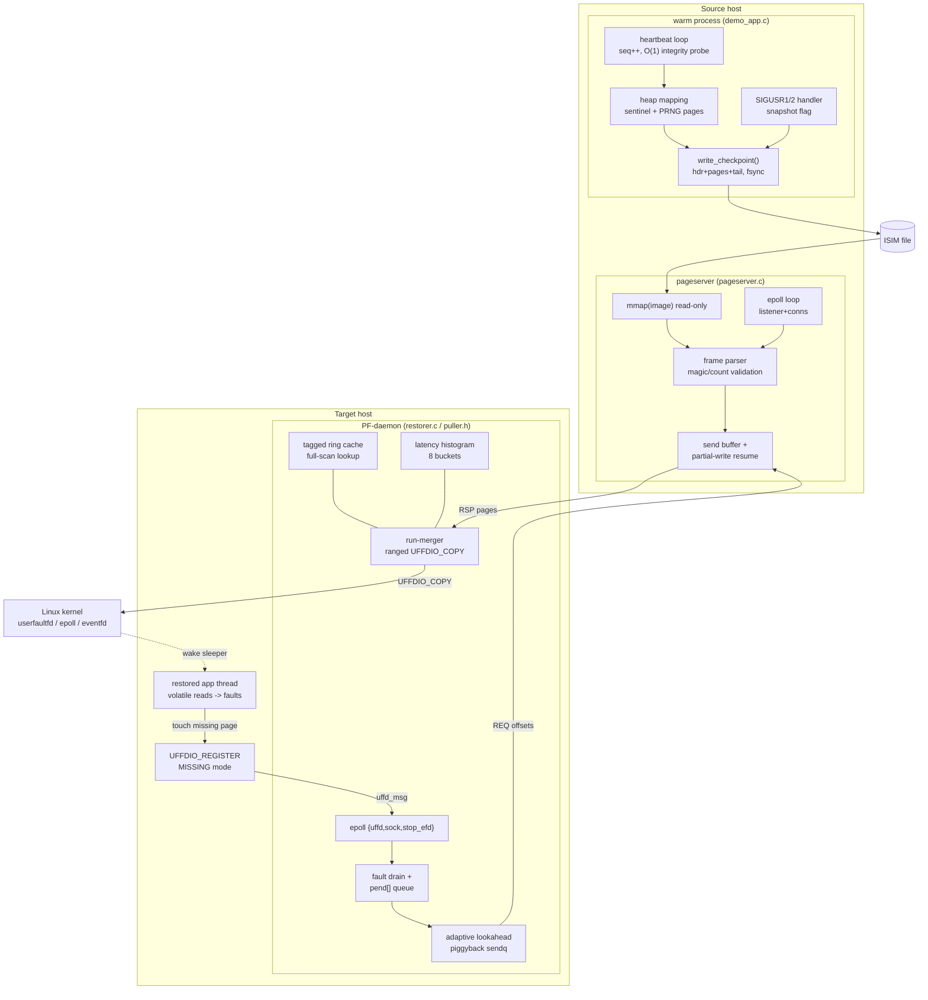

# Architecture

InstantScale separates **process activation** from **memory transfer**.
A checkpointed process resumes with only a skeleton (registers-equivalent
metadata: seq, uptime, geometry) and pulls its heap over the network on
demand, one 4 KB page at a time, through `userfaultfd`.

## Module inventory (verified against source)

| Module | File | Responsibility |
|---|---|---|
| wire helpers | `phase2/common.h` | framing structs, CRC32, sockets, `is_die` errno-exact failures |
| image builder | `phase2/seeder.c`, `demo_app.c:write_checkpoint` | deterministic ISIM images |
| page server | `phase2/pageserver.c` | mmap'd image, per-conn rbuf/sbuf, EPOLLIN/OUT arming |
| restorer daemon | `phase2/restorer.c:daemon_main` | batching, adaptive-K, ring, merging, histograms |
| lifecycle app | `phase3/demo_app.c` | cold tax, warm-up, heartbeats, self-checkpoint, resume |
| condensed puller | `phase3/puller.h` | same daemon shape for lazy-resume inside demo_app |
| CRIU analyzer | `phase3/analyze.c` | skeleton-vs-bulk split of real CRIU dirs |
| orchestrators | `phase{3,4}/*.sh`, `iscale.ps1`, compose | sequencing, gates, timing extraction |

## External dependencies

| Dependency | Kind | Required at |
|---|---|---|
| Linux kernel ≥ 5.11 (`userfaultfd`) | platform | target runtime |
| `epoll` / `eventfd` / `mmap` / `nanosleep` | kernel syscalls | everywhere |
| Docker Desktop (WSL2 backend) or native Linux | dev/test | CI + Windows workflow |
| CRIU v4.1 (source-built in CI) | optional | arbitrary-process migration |

No databases, message brokers, or managed services are used — the only
"storage" is the checkpoint file on disk.

## Graceful degradation matrix

| Dependency / event | Failure mode | Detection | Policy | User impact |
|---|---|---|---|---|
| pageserver process dies mid-stream | TCP FIN/RST | `recv == 0` → `ECONNRESET` die in daemon | fail-fast with exact errno | restored instance aborts; orchestrator restarts pair |
| transient network loss | retransmit stalls | TCP timers | transparent (TCP) | hydration slows; activation unaffected |
| prefetched page evicted from ring before its fault | stale `ST_REQ` state | fault finds no ring entry | idempotent re-request (ADR-0005) | none beyond one extra RTT |
| duplicate response for already-local page | extra frame | `pend_find` misses → ring park | harmless by immutability | none |
| out-of-range offset from peer | protocol violation | bounds check both sides | connection drop / `EPROTO` fail-fast | none (misbehaving peer only) |
| `userfaultfd` blocked (seccomp/sysctl) | `EPERM/ENOSYS` at syscall | explicit hint printed | exit with remediation text | operator sets sysctl or runs privileged |
| partial socket write (EAGAIN) | would-block | send loop + EPOLLOUT re-arm | resume cursor | none |
| ioctl UFFDIO_COPY EAGAIN/EINTR | transient kernel state | retry loop with cursor advance | bounded spin then error | negligible |
| heartbeat file unreadable during poll | missing file | grep guarded `\|\| true` | keep polling until timeout | delayed detection only |
| CRIU unavailable (docker-desktop kernel) | package/caps absent | probe step skips | eager/lazy own-lifecycle path carries product | CRIU-specific flows deferred to native Linux |

## Performance budget per layer (measured)

Numbers from `PAGES=16384` (64 MB) runs on WSL2 5.15 loopback unless noted.

| Layer / step | Budget | Measured |
|---|---|---|
| handshake + skeleton (META round-trip) | ≤ 1 RTT | ~0.3 ms total to `RUNNING` (incl. connect) |
| first-touch resolution (trap→wire→install→wake) | < 250 µs p99 | histogram: 2484/<50 µs, 755/50–100 µs, 35/100–250 µs, 0 above 500 µs except 2 |
| request batching | amortize RTT | 16,384 pages served via 440 network-fault batches post run-merging |
| installation syscalls | amortize ioctl | 13,703 pages in ranged installs (~31 pages/ioctl) |
| hydration throughput ceiling (loopback) | line-rate bound | **439 MB/s** lazy vs ~1,200 MB/s eager memcpy baseline |
| activation floor cross-host | ≈ RTT | **2.45 ms** docker-bridge hop |
| fan-out spike (10 replicas, one server) | server memcpy + uffd install bound | all RUNNING in 21–33 ms wall |

Design decisions behind each budget line are recorded in
[docs/decisions/](docs/decisions/) (ADR-0003, ADR-0004, ADR-0010).
