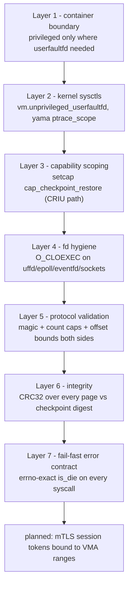
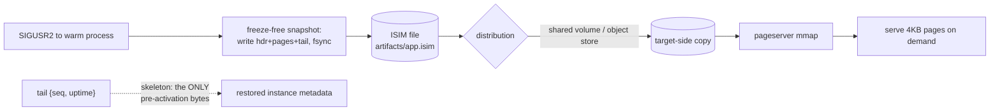
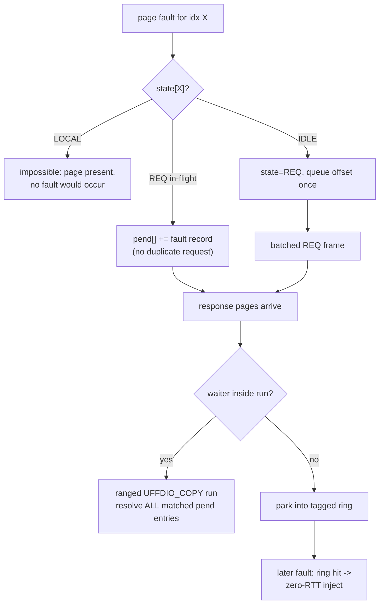
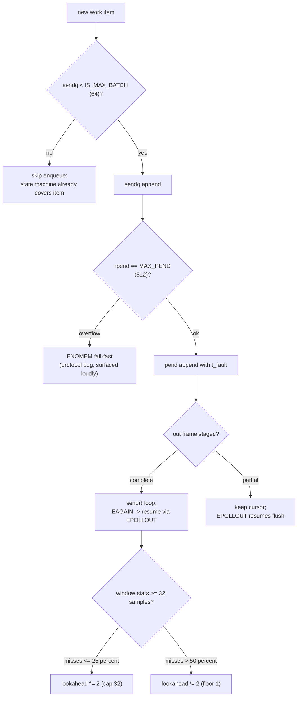
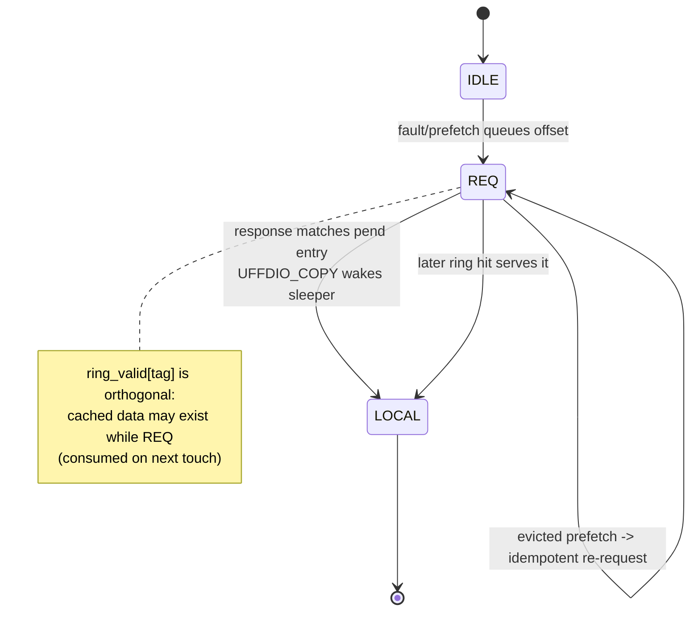
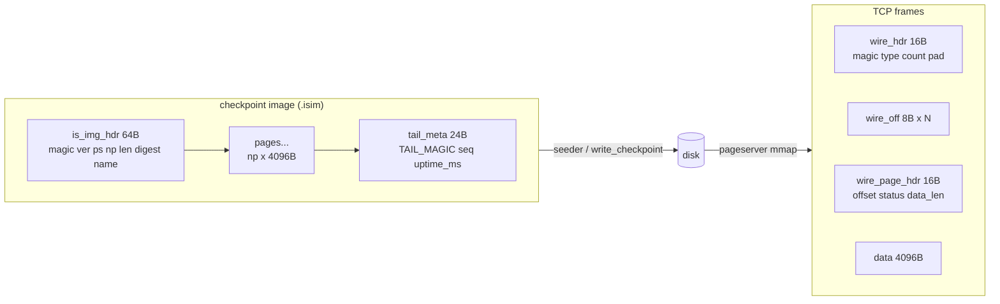
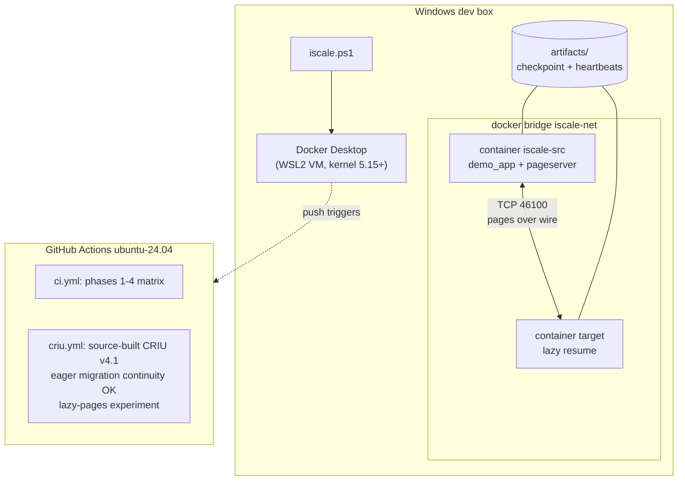

# Diagrams — visual reference

One diagram per concept. All render natively on GitHub.

## 1. Security defense-in-depth

## 2. Checkpoint / state distribution pipeline

## 3. Single-flight / deduplication

## 4. Backpressure / throttling decision flow

## 5. Page state machine (resilience core)

## 6. Data layout — ISIM image and wire frames

## 7. Deployment topology

